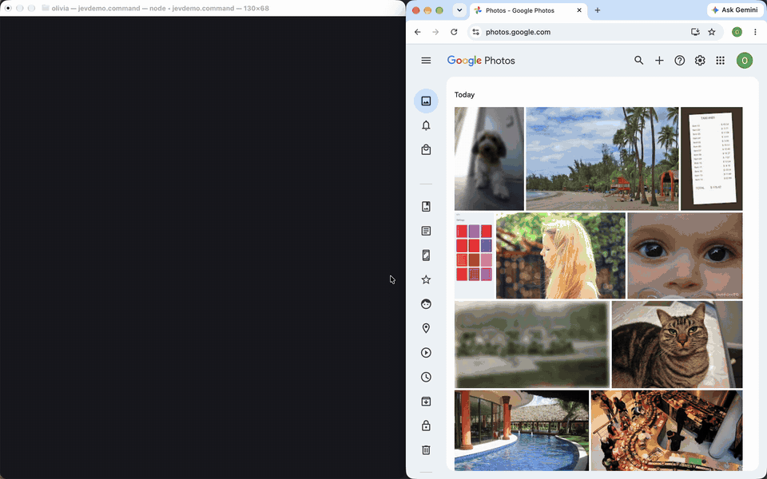

# jevsort

jevsort sorts a Google Photos library into albums and finds junk and duplicate photos, with Jev by
TypeSafe AI making every decision. Jev is a "System One" model: it doesn't generate text. It takes a JSON
`state` plus typed questions and returns calibrated typed answers (`choice` with per-option probabilities,
`score` or `noul` yes/no probability) in about 70-500ms, at roughly $0.042 per million input tokens. Jev
can't see pixels, so jevsort turns each photo into a short text description on your Mac (CLIP labels,
sharpness, exposure, shape, duplicate hashes) and asks Jev two questions: which album, and should this be
proposed for deletion? It never deletes a photo. Deletion candidates go into an album for you to check,
and one command undoes every album change.

On a 164-photo demo library: full scan in ~10s including grid scrolling (two batches, ~1-2s each to
classify), ~180-250ms average per Jev decision and ~$0.006 of Jev usage in total. Applying the 12 resulting
albums in parallel takes ~13-19s, and `restore` undoes it in ~5s.

## Demo



The GIF runs at 3x speed. Real-time recording (68s): [docs/demo.mp4](docs/demo.mp4). Left: the terminal feed with
Jev's album confidence and delete probability for every photo. Right: the logged-in Chrome being driven.

## Why this demos better than existing photo organisers

| Existing approach | jevsort |
| --- | --- |
| Google's auto-albums and suggestions are opaque | Every decision has calibrated probabilities, shown live and saved in `results.jsonl` |
| Rule and date-based tools don't understand content | CLIP content labels and pixel stats; Jev prefers your existing albums |
| All-or-nothing automation | A confidence threshold sends uncertain photos to "Jev: needs review" |
| LLM agents take seconds and cents per step | Milliseconds per decision; ~$0.006 for 164 photos |
| Cleanup tools delete photos directly | Never deletes photos; `restore --yes` undoes every album change |
| Photos copied to another service | 512px thumbnails held in memory only; no image files written; Jev only ever sees text |

## How it works

There is no official API route: since 31 March 2025 the Google Photos Library API can only access media
created by the app itself, and the Picker API can't organise albums or delete. So jevsort drives your own
logged-in Chrome over the Chrome DevTools Protocol (CDP) with Playwright.

```
Chrome (CDP)     photos.google.com, separate debugging profile, logged in
     |  scroll the library grid: photo ids + thumbnail URLs (videos skipped)
     |  512px thumbnails, batches of 100, in memory, next batch prefetched
     v
signals.py       CLIP ViT-B-32 labels + junk likelihood, sharpness, exposure,
                 shape, phash + CLIP-embedding near-duplicates  ->  text state
     |
     v
processor.py     one Jev request per photo: album (choice) + delete (noul)  <-->  Jev API
     |           confidence routing
     v
results.jsonl    id, state, answers, actions (~1 KB of JSON per photo, resumable)
     |
     v
apply --yes      per album: multi-select in the grid, one "Create or add to album"
                 action; albums in parallel tabs; undo journal apply_log.json
     |
     v
restore --yes    delete albums it created, remove photos it added, verify
```

Signals per photo (`signals.py`, `processor.py`):

- **Content**: zero-shot CLIP over your existing album names plus 10 default categories (people, pets, food,
  nature, beach, city, documents and receipts, screenshots, cars, parties); top 3 labels.
- **Junk**: CLIP likelihood of "accidental" (pocket, floor, finger) and "blurry" against a "clear, intentional" photo.
- **Sharpness**: Laplacian variance, bucketed as very blurry (< 20), somewhat blurry (< 80) or sharp.
- **Exposure**: nearly black (mean < 20) or blank, almost one flat colour (std < 10).
- **Shape**: taller than 1.9:1 is reported as a phone-screen shape, typical of screenshots.
- **Near-duplicates**: phash distance <= 8 and CLIP similarity >= 0.97 (>= 0.995 for screenshots and
  documents); the less sharp copy is marked as the worse copy.

A real (trimmed) Jev request from the demo run, for a slightly worse duplicate of a food photo:

```json
{
  "state": {
    "google_photos_label": "Photo - Landscape - Sep 26, 2026, 1:51:39 PM",
    "shape": "landscape", "sharpness": "sharp", "exposure": "normal",
    "content_labels": {"food and drinks": 0.52, "parties and events": 0.48, "cars and vehicles": 0.0},
    "junk_likelihood": {"accidental": 0.66, "blurry": 0.05},
    "near_duplicate": {"hash_distance": 6, "visual_similarity": 0.992, "this_is_the_worse_copy": true}
  },
  "questions": {
    "album": {"type": "choice",
      "instructions": "Which album should this photo be filed into? Prefer an existing album when it fits.",
      "criteria": {"n2": "Create a new album 'Food and drinks' for photos of food and drinks",
                   "n9": "Create a new album 'Parties and events' for photos of parties and events",
                   "none": "Does not clearly belong in any album; leave it unsorted"}},
    "delete": {"type": "noul",
      "instructions": "Should this photo be proposed to the user for deletion?",
      "criteria": {"true": "It is the worse copy of a near-duplicate, or it is junk: very blurry, accidental, or blank",
                   "false": "It is a normal photo worth keeping, even if imperfect, or it is the better copy of a duplicate"}}
  }
}
```

Jev answered `album: n2` (confidence 0.64, `none` 0.15) and `delete: 0.93` in 139ms. The demo library had
no albums; otherwise existing albums come first as `a0`, `a1`, ... and a category is only offered as a new
album if no album of that name exists. Photos in a batch are sent concurrently (up to 15 in flight), then routed:

| Jev answer | Result |
| --- | --- |
| delete >= 0.8 | "Jev: proposed deletions" only |
| delete 0.5-0.8 | "Jev: needs review", and still filed by its album answer |
| album confidence >= `--threshold` (0.6) | That album (new ones are created on apply) |
| album confidence below threshold | "Jev: needs review" |
| album `none` | Left unsorted |

## Setup

Prerequisites: macOS, Google Chrome, [uv](https://docs.astral.sh/uv/), Python 3.12 (uv installs it) and a
TypeSafe API key. Run `uv sync`, then create `.env` in the repo root containing `TYPESAFE_API_KEY=<your key>`
(optional overrides: `JEV_URL` and `JEV_MODEL`, default `jev-latest`).

Start Chrome with remote debugging on a separate profile (Chrome 136+ refuses remote debugging on the
default profile), then log into [photos.google.com](https://photos.google.com) in that window once. Google
Photos must be in English.

```sh
open -na "Google Chrome" --args --remote-debugging-port=9222 --user-data-dir="$HOME/.jevathon-chrome"
```

Smoke tests:

```sh
uv run jevsort ping     # one Jev call: prints the answer and latency
uv run jevsort albums   # lists your albums through Chrome
```

The first scan downloads the CLIP weights (~600MB, one time); CLIP uses the Apple Silicon GPU when available.

## Usage

```sh
uv run jevsort scan                   # classify up to 300 new photos into results.jsonl
uv run jevsort apply                  # dry run: albums and photo counts
uv run jevsort apply --yes            # add photos to albums in parallel tabs
uv run jevsort restore                # dry run: what would be undone
uv run jevsort restore --yes          # undo, verify, archive the journal
```

| Flag | Command | Default | Meaning |
| --- | --- | --- | --- |
| `--limit` | `scan` | 300 | New photos to process |
| `--batch` | `scan` | 100 | Thumbnails per in-memory batch |
| `--threshold` | `scan` | 0.6 | Album confidence needed to auto-file |
| `--yes` | `apply`, `restore` | off | Change Google Photos (otherwise a dry run) |
| `--tabs` | `apply`, `restore` | 12 | Albums processed in parallel browser tabs |
| `--results` | global | `results.jsonl` | Results file |
| `--log` | global | `apply_log.json` | Undo journal |

Global flags go before the subcommand, e.g. `uv run jevsort --results demo.jsonl scan`.

- **scan** prints a live feed (album confidence and delete probability bars per photo) and a per-batch line with
  Jev calls, cost and average latency. It is resumable: photos already in `results.jsonl` are skipped and failed
  Jev calls are retried on the next scan. Routing happens at scan time, so delete `results.jsonl` and scan again
  to try another `--threshold`.
- **apply** snapshots any pre-existing album it will touch, then multi-selects each album's photos in the
  library grid and adds them in one action. Everything is recorded in `apply_log.json`.
- **restore** deletes albums jevsort created (their photos stay in the library), removes photos it added to
  pre-existing albums, checks nothing is left, then archives the journal as `apply_log.restored-<timestamp>.json`.

## Demo script

1. Optional, once: `uv run python scripts/demo_set.py --upload` and `uv run python scripts/demo_set.py --set 2 --upload`
   each build 84 photos (in `/tmp/jevsort-demo` and `/tmp/jevsort-demo-2`) and upload them through the debugging Chrome
   (ideally into a spare Google account). Each set is 57 CC-licensed Flickr photos via Openverse (set N uses results
   page N) plus engineered near-duplicates, blurry shots, black frames, pocket shots, screenshots and receipts.
   Google Photos skips byte-identical files, so the two sets together give ~164 photos. Add `--rebuild` to regenerate.
2. `rm -f results.jsonl` so the scan starts fresh, then `uv run jevsort ping` to show one decision's latency.
3. `uv run jevsort scan`: the live feed fills with probability bars; the batch lines show ~$0.006 total and the
   average latency per decision.
4. `uv run jevsort apply`: the dry-run plan, 12 albums including "Jev: proposed deletions" (27 photos) and
   "Jev: needs review" (~10).
5. `uv run jevsort apply --yes`: watch the Chrome tabs fill albums in parallel (~13-19s).
6. Open "Jev: proposed deletions" in Google Photos: blurry shots, black frames, pocket shots and worse duplicates.
   Known miss in the demo set: two generated screenshots share one template and get flagged as duplicates of each
   other, which makes a good talking point for why deletions are only proposed.
7. `uv run jevsort restore --yes` to put the albums back as they were for the next run.

## Project layout

```
src/jevsort/
  __main__.py     CLI: scan, apply, restore, albums, ping
  pipeline.py     batched scan with prefetch, live feed, apply plan, parallel tabs, restore, Journal
  photos.py       Google Photos browser automation over CDP: grid, thumbnails, selection, albums
  signals.py      CLIP labels and junk prompts, sharpness, exposure, shape, phash
  processor.py    Jev state and questions, near-duplicate matching, confidence routing
  jev.py          async Jev client: retries, concurrency, cost and latency tracking
  models.py       contract between pipeline and processor
scripts/demo_set.py   build and upload the demo library
```

## Safety and limitations

- Photos are never deleted. Proposed deletions are just an album; deleting them is up to you. The only things
  jevsort deletes are albums it created, during `restore --yes`.
- `restore` only undoes album changes recorded in `apply_log.json`. It doesn't remove photos uploaded by
  `scripts/demo_set.py`.
- Only the English Google Photos UI is supported, and the UI automation can break if Google changes the page.
- Duplicates split across batches are only seen from the later photo's side. If the sharper copy arrives in a later
  batch, the worse copy has already been decided and isn't flagged. After a resume, earlier photos are compared by
  perceptual hash only, because CLIP embeddings aren't saved.
- CLIP labels are zero-shot, so vague album names or categories can misfire. Screenshots with the same layout can
  match as duplicates, so check the proposals album before deleting anything.
- Chrome may throttle background tabs on very large libraries; lower `--tabs` if applying stalls.

## Contributing

See [CONTRIBUTING.md](CONTRIBUTING.md), the [code of conduct](CODE_OF_CONDUCT.md) and, for reporting
vulnerabilities privately, [SECURITY.md](SECURITY.md).

## License

MIT, see [LICENSE](LICENSE). Third-party dependencies, model weights and services are listed in
[THIRD_PARTY_NOTICES.md](THIRD_PARTY_NOTICES.md). Using Jev requires a TypeSafe API key and is subject
to TypeSafe AI's terms.
